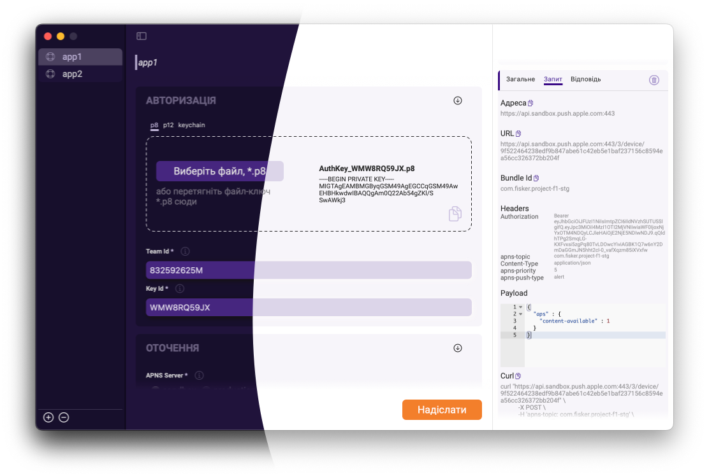
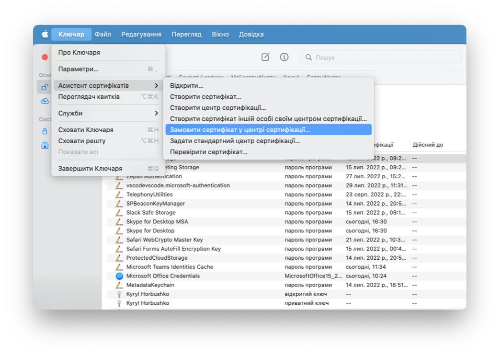
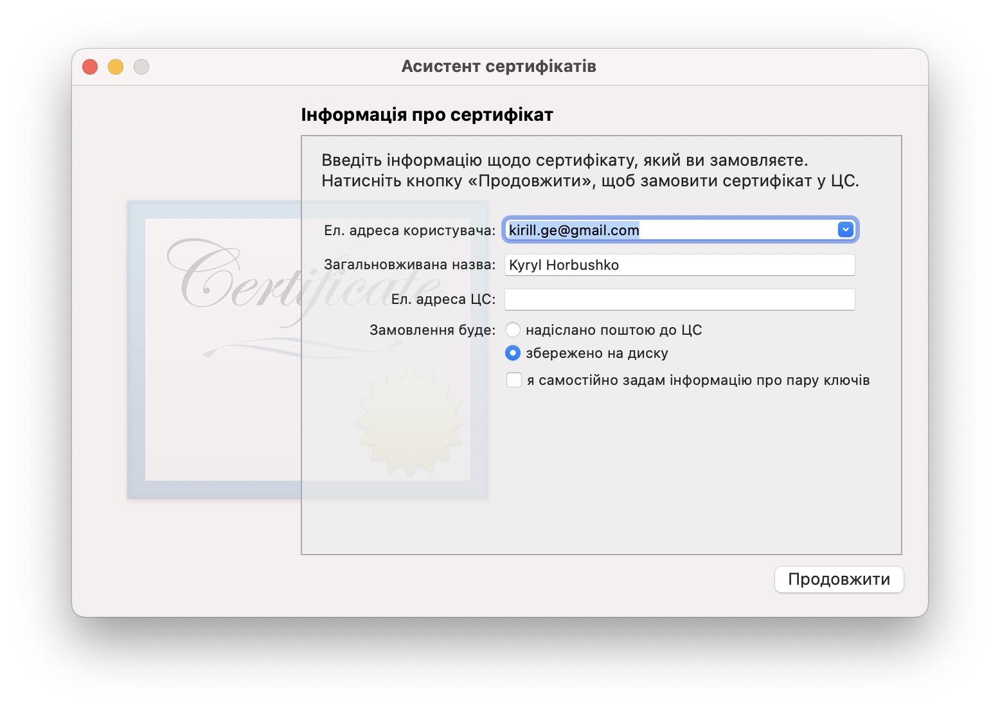
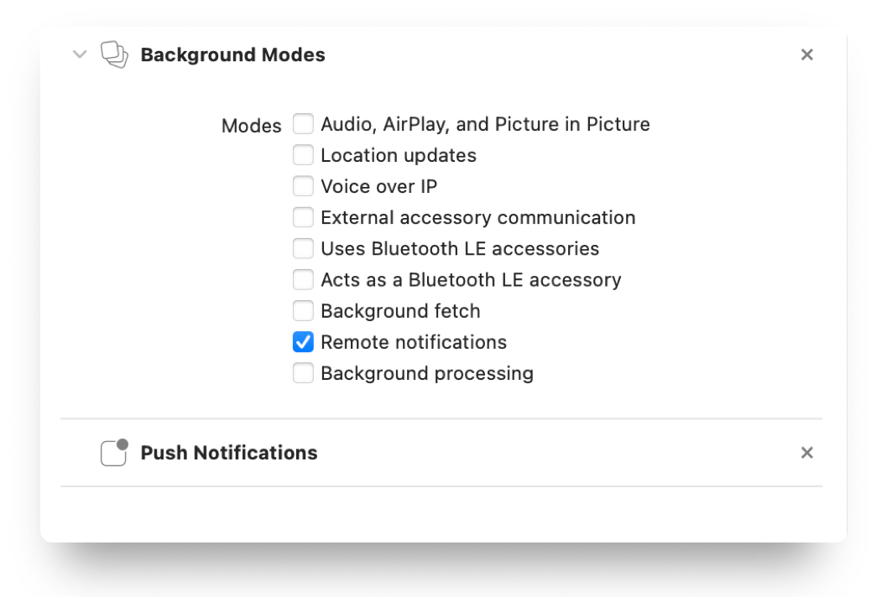

<p align="center">
  <a href="">
    
  </a>
</p>

<br>

<p align="left">
  
  
  
</p>

🇺🇦


OS X app for sending push with Apple Push Notification service (APNs) over HTTP/2 API.

- [About](#about)
- [Feature](#features)
- [Quick guide](#quick-guide)
- [License](#license)
- [Thanks to](#thanks-to)
- [Contact](#contact)

## About

This app was created just to allow painless testing of push notifications.

It's completely open source and any improvements are welcome.



> The whole story with app started quite ago. [Here](https://khorbushko.github.io/article/2021/11/13/push-routine.html) my blog-post about first attemp. On this blog I will try to cover the most interesting features and functionality related to the app soon.

## Features

App supports all basic ways of sending push notifications. 

Main features are:
	
- [x] Auth with p8 key
- [x] Auth with p12 cert
- [x] Auth with keychain
- [x] Custom push paylod
- [x] Payload JSON validation
- [x] Predefined payloads
- [x] Full customization of push
- [x] Build in hints
- [x] Multiply sessions
- [x] Session persistants
- [x] History with detailed info
- [x] Inspection of request with option to use curl for p8 auth
- [x] Rich failure description
- [x] Light/Dark mode
- [x] Written in Swift

In progress:

- [] Create reusable sp for APNS
- [] Support generate terminal command
- [] Live push preview

## Quick guide

Configre apple developer account:

* generate certificate sign request on mac (Keychain->File->Request certificate sign identity)




* Log in to [Apple's Dev Center](https://developer.apple.com/)
* Go to the Provisioning Portal or Certificates, Identifiers & Profiles
* Create app identifier
* Add certificate for push (sandbox and/or production)
* Create p8 Key at Apple's Dev Center to use the app (optional)

In the project u need to allow required capabilities:



Then in u'r project `App`:

> assuming u use `SwiftUI`

1) declare `UIApplicationDelegateAdaptor`

```
@main
struct AuthentificatorApp: App {

  @UIApplicationDelegateAdaptor
  private var appDelegate: AppDelegate
  
  ....
```

2) handle callbacks

```
final class AppDelegate: NSObject, UIApplicationDelegate {

  private let pushHandle: PushTokenHandle = .init()

  func application(
    _ application: UIApplication,
    didFinishLaunchingWithOptions launchOptions: [UIApplication.LaunchOptionsKey: Any]? = nil
  ) -> Bool {
    pushHandle.performStartConfig()
    pushHandle.handleIfAppOpenedWithNotificationInfo(launchOptions: launchOptions)

    return true
  }

  func application(
    _ application: UIApplication,
    didRegisterForRemoteNotificationsWithDeviceToken deviceToken: Data
  ) {
    pushHandle.subscribeUsing(pushToken: deviceToken)
  }

  func application(
    _ application: UIApplication,
    didFailToRegisterForRemoteNotificationsWithError error: Error
  ) {
  // handle error
  }
}
```

implemntation of `PushHandle`:

```
final public class PushTokenHandle: NSObject {

  func performStartConfig() {
    UNUserNotificationCenter.current().delegate = self
  }

  func subscribeUsing(pushToken: Data) {
    let deviceToken = pushToken.hexString
  }
}

extension PushTokenHandle: UNUserNotificationCenterDelegate {
  public func userNotificationCenter(
    _ center: UNUserNotificationCenter,
    willPresent notification: UNNotification,
    withCompletionHandler completionHandler: @escaping (UNNotificationPresentationOptions
    ) -> Void) {
    let userInfo = notification.request.content.userInfo
    completionHandler([.banner, .badge, .sound])
  }

  public func userNotificationCenter(
    _ center: UNUserNotificationCenter,
    didReceive response: UNNotificationResponse,
    withCompletionHandler completionHandler: @escaping () -> Void
  ) {
    let userInfo = response.notification.request.content.userInfo

    handlePushTap(userInfo)
    completionHandler()
  }
}

extension PushTokenHandle {

  func handleIfAppOpenedWithNotificationInfo(launchOptions: [UIApplication.LaunchOptionsKey: Any]?) {
    if let remotePushObject = launchOptions?[UIApplication.LaunchOptionsKey.remoteNotification] {
      // parse object and send
    }
  }

  func handlePushTap(_ response: [AnyHashable: Any]) {
    let application = UIApplication.shared
    if application.applicationState == .active {
      debugPrint("user tapped the notification bar when the app is in foreground")
    }

    if application.applicationState == .inactive {
      debugPrint("user tapped the notification bar when the app is in background")
    }
  }
}
```

3) convert `data` to tokenString:

```
public extension Data {

  var hexString: String {
    let parts = self.map { data in String(format: "%02.2hhx", data) }
    let value = parts.joined()
    return value
  }
}
```

More info about APNS [here](https://developer.apple.com/documentation/usernotifications) and [here](https://developer.apple.com/library/archive/documentation/NetworkingInternet/Conceptual/RemoteNotificationsPG/index.html#//apple_ref/doc/uid/TP40008194-CH3-SW1)

## License

[MIT licensed.](LICENSE)

## Thanks to

* [ethanhuang13](https://github.com/ethanhuang13/CupertinoJWT) for Cuppertino JWT
* [dwarvesf](https://github.com/dwarvesf/CodeViewer) for CodeViewer
* [TCA](https://www.pointfree.co) for architecture
* [Lottie](https://lottiefiles.com) for animation
* [omnyway133](https://onmyway133.com/pushhero/) for idea


## Contact

Have a question or an issue about `PushHandle`? Create an [issue](https://github.com/khorbushko/pushHandle/issues/new)!

If you would like to contribute - just create a pull request.
