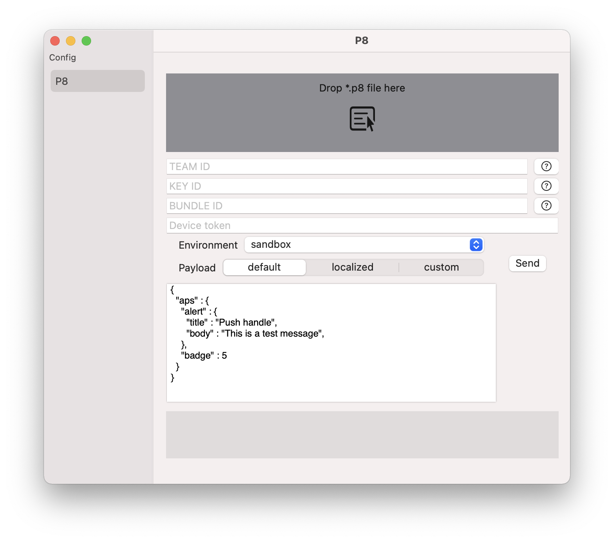
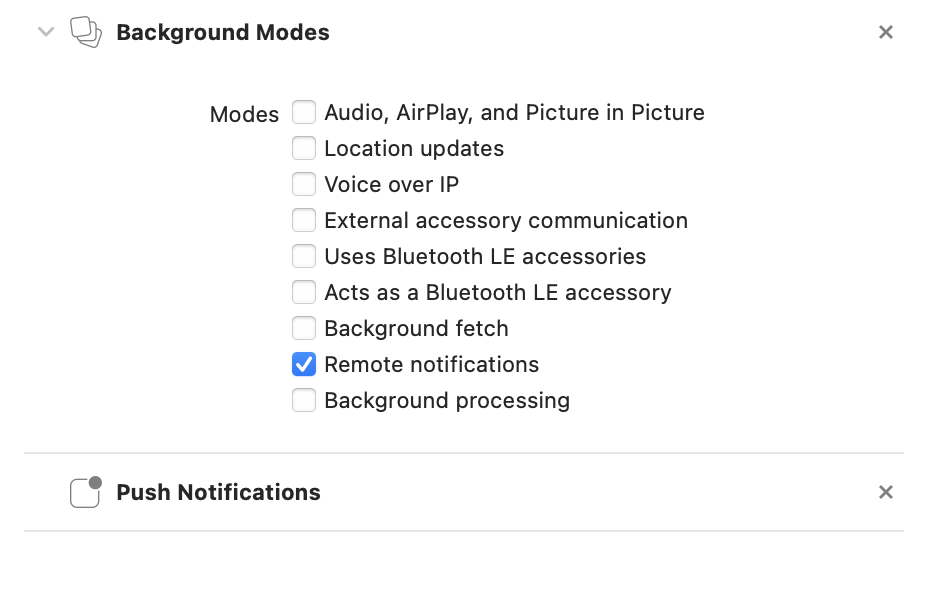

# pushHandle
OS X app for sending push with Apple Push Notification service (APNs)

<p align="left">
  
  
  </a>
    <a href="https://github.com/icon-project/ICONKit" target="_blank">
    
  </a>
</p>


## About

This app was created just to allow painless testing of push notifications.

> This app is in progress and for now have just a minimal implementation for testing with p8 key



> The work in progress...

## Features

[x] sandbox/production mode

[x] customizable payload

[x] report errors and steps done under the hood

[x] .p8 support

[ ] payload syntax check

[ ] .p12 support

[ ] export request to curl

[ ] session store (for later reuse)

## Small guide

### get device apns token

Configre apple developer account:

* generate certificate sing request on mac (Keychain->File->Request certificate sign identity)


* Log in to [Apple's Dev Center](https://developer.apple.com/)
* Go to the Provisioning Portal or Certificates, Identifiers & Profiles
* Create app identifier
* Add certificate for push (sandbox and/or production)
* Create p8 Key at Apple's Dev Center to use the app

In the project u need to allow required capabilities:



Then in u'r project `App`:

> assuming u use `SwiftUI`

1) declare `UIApplicationDelegateAdaptor`

```
@main
struct AuthentificatorApp: App {

  @UIApplicationDelegateAdaptor
  private var appDelegate: AppDelegate
  
  ....
```

2) handle callbacks

```
final class AppDelegate: NSObject, UIApplicationDelegate {

  private let pushHandle: PushTokenHandle = .init()

  func application(
    _ application: UIApplication,
    didFinishLaunchingWithOptions launchOptions: [UIApplication.LaunchOptionsKey: Any]? = nil
  ) -> Bool {
    pushHandle.performStartConfig()
    pushHandle.handleIfAppOpenedWithNotificationInfo(launchOptions: launchOptions)

    return true
  }

  func application(
    _ application: UIApplication,
    didRegisterForRemoteNotificationsWithDeviceToken deviceToken: Data
  ) {
    pushHandle.subscribeUsing(pushToken: deviceToken)
  }

  func application(
    _ application: UIApplication,
    didFailToRegisterForRemoteNotificationsWithError error: Error
  ) {
  // handle error
  }
}
```

implemntation of `PushHandle`:

```
final public class PushTokenHandle: NSObject {

  func performStartConfig() {
    UNUserNotificationCenter.current().delegate = self
  }

  func subscribeUsing(pushToken: Data) {
    let deviceToken = pushToken.hexString
  }
}

extension PushTokenHandle: UNUserNotificationCenterDelegate {
  public func userNotificationCenter(
    _ center: UNUserNotificationCenter,
    willPresent notification: UNNotification,
    withCompletionHandler completionHandler: @escaping (UNNotificationPresentationOptions
    ) -> Void) {
    let userInfo = notification.request.content.userInfo
    completionHandler([.banner, .badge, .sound])
  }

  public func userNotificationCenter(
    _ center: UNUserNotificationCenter,
    didReceive response: UNNotificationResponse,
    withCompletionHandler completionHandler: @escaping () -> Void
  ) {
    let userInfo = response.notification.request.content.userInfo

    handlePushTap(userInfo)
    completionHandler()
  }
}

extension PushTokenHandle {

  func handleIfAppOpenedWithNotificationInfo(launchOptions: [UIApplication.LaunchOptionsKey: Any]?) {
    if let remotePushObject = launchOptions?[UIApplication.LaunchOptionsKey.remoteNotification] {
      // parse object and send
    }
  }

  func handlePushTap(_ response: [AnyHashable: Any]) {
    let application = UIApplication.shared
    if application.applicationState == .active {
      debugPrint("user tapped the notification bar when the app is in foreground")
    }

    if application.applicationState == .inactive {
      debugPrint("user tapped the notification bar when the app is in background")
    }
  }
}
```

3) convert `data` to tokenString:

```
public extension Data {

  var hexString: String {
    let parts = self.map { data in String(format: "%02.2hhx", data) }
    let value = parts.joined()
    return value
  }
}
```

More info about APNS [here](https://developer.apple.com/documentation/usernotifications) and [here](https://developer.apple.com/library/archive/documentation/NetworkingInternet/Conceptual/RemoteNotificationsPG/index.html#//apple_ref/doc/uid/TP40008194-CH3-SW1)

## License

[MIT licensed.](LICENSE)

## Thanks to

* [ethanhuang13](https://github.com/ethanhuang13/CupertinoJWT)

## Contact

Have a question or an issue about `PushHandle`? Create an [issue](https://github.com/khorbushko/pushHandle/issues/new)!

If you would like to contribute - just create a pull request.
